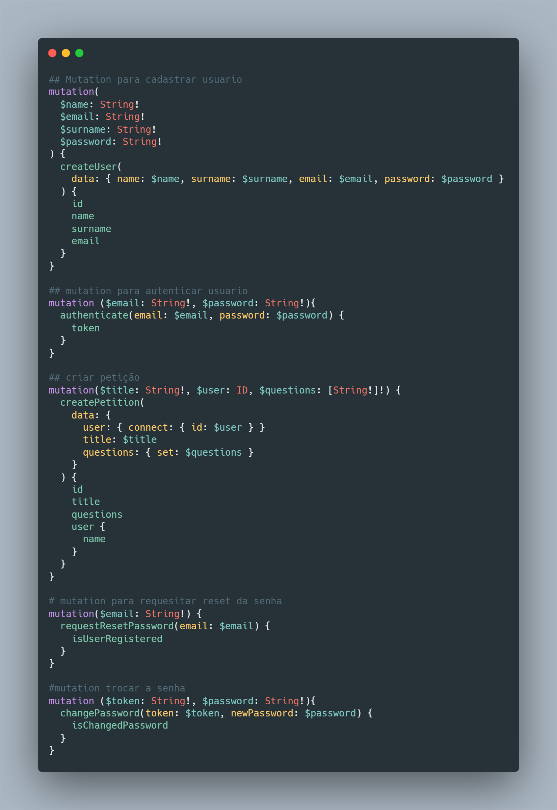

# Backend

# Dependencias

Node, npm e docker

### Build docker image

```bash
docker build -t allancontesini/backend-prisma:tagname .
```

### Push new image to docker registry
```
docker push allancontesini/backend-prisma:tagname
```

### Pull image from docker 
```
docker pull llancontesini/backend-prisma:tagname
```

Mutations uteis

